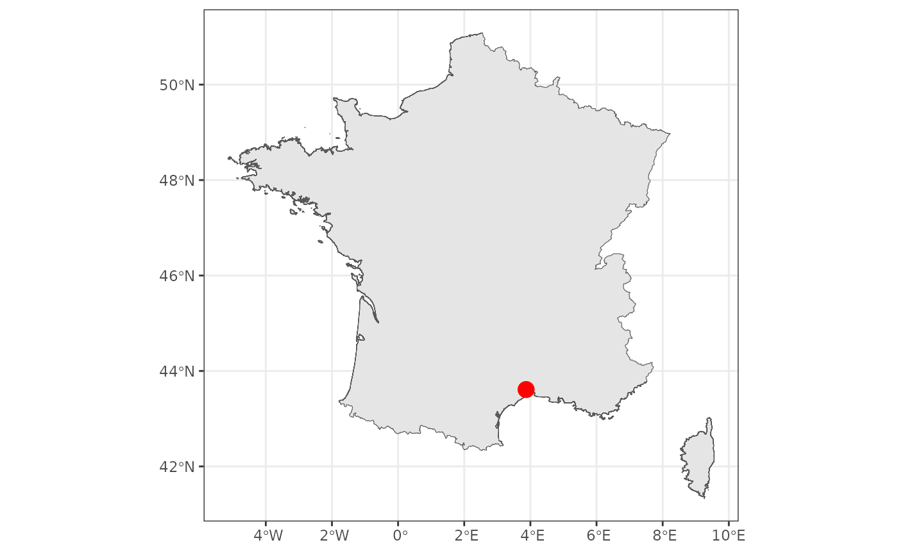

# Get started

The package `rgeoservices` is a R client streamlining access to the
services provided by the French National Institute of Geographic and
Forest Information (IGN) through its open access
[Geoplatform](https://geoservices.ign.fr/documentation/services/services-geoplateforme).
This Geoplatform can be used to query the IGN BD TOPO® database to
retrieve geographical information.

**Note:** The IGN Geoplatform provides information **only for French
locations**.

Let’s load and attach the package `rgeoservices`.

``` r
## Attach 'rgeoservices' package ----
library(rgeoservices)
library(mapview)
library(ggplot2)
```

## The Geocoding service

The IGN Geoplatform provides the [Geocoding
service](https://geoservices.ign.fr/documentation/services/services-geoplateforme/geocodage).
This service can be used in two different ways:

- to retrieve geographical coordinates and administrative information
  from an address (or a point of interest)
- to retrieve an address (or a point of interest) from geographical
  coordinates.

### Retrieve geographical coordinates

User can retrieve geographical coordinates and administrative
information (postal code, INSEE code, city, etc.) from any French
address (postal address, street, city) or any point of interest (POI)
such as city hall, museum, public garden, lake, etc. This service is
implemented in the
[`gs_get_coordinates()`](https://ahasverus.github.io/rgeoservices/reference/gs_get_coordinates.html)
function of `rgeoservices`.

#### Postal address

Let’s try to retrieve geographical coordinates of a **postal address**.

``` r
## Retrieve coordinates from an address ----
x <- gs_get_coordinates(
  query = "5 rue de l'Ecole de Médecine", 
  index = "address",
  limit = 10
)
```

| query                        | longitude | latitude | label                                     | name                         | toponym | housenumber | street                     | city        | postcode | citycode | context                  | category |   score |
|:-----------------------------|----------:|---------:|:------------------------------------------|:-----------------------------|:--------|:------------|:---------------------------|:------------|:---------|:---------|:-------------------------|:---------|--------:|
| 5 rue de l’Ecole de Médecine |  2.341955 | 48.85059 | 5 Rue de l’Ecole de Médecine 75006 Paris  | 5 Rue de l’Ecole de Médecine | NA      | 5           | Rue de l’Ecole de Médecine | Paris       | 75006    | 75106    | 75, Paris, Île-de-France | NA       | 0.96654 |
| 5 rue de l’Ecole de Médecine |  3.873477 | 43.61278 | 5 Rue Ecole de Médecine 34000 Montpellier | 5 Rue Ecole de Médecine      | NA      | 5           | Rue Ecole de Médecine      | Montpellier | 34000    | 34172    | 34, Hérault, Occitanie   | NA       | 0.80125 |

The argument `index` is used to indicate to search from an address
(`index = 'address'`) or a point of interest (`index = 'poi'`).
Depending on the value of this argument, some columns can be `NA`.

User can filter results by using additional parameters:

- `postcode` or `city` to specify the **postal code** or the **city
  name** associated to the address
- `type` to specify the precision of the address, e.g. `housenumber`,
  `street`, `locality`, or `municipality`

``` r
## Retrieve coordinates from an address (with filters) ----
x <- gs_get_coordinates(
  query    = "5 rue de l'Ecole de Médecine", 
  index    = "address",
  limit    = 10,
  postcode = "34000",
  type     = "housenumber"
)
```

| query                        | longitude | latitude | label                                     | name                    | toponym | housenumber | street                | city        | postcode | citycode | context                | category |   score |
|:-----------------------------|----------:|---------:|:------------------------------------------|:------------------------|:--------|:------------|:----------------------|:------------|:---------|:---------|:-----------------------|:---------|--------:|
| 5 rue de l’Ecole de Médecine |  3.873477 | 43.61278 | 5 Rue Ecole de Médecine 34000 Montpellier | 5 Rue Ecole de Médecine | NA      | 5           | Rue Ecole de Médecine | Montpellier | 34000    | 34172    | 34, Hérault, Occitanie | NA       | 0.80125 |

Using these filters can help getting better results.

Let’s display the result on an interactive map.

``` r
## Convert to spatial object ----
x <- sf::st_as_sf(
  x      = x,
  coords = c("longitude", 'latitude'),
  crs    = sf::st_crs(4326)
)

## Setup 'mapview' ----
mapviewOptions(
  basemaps           = "OpenStreetMap",
  legend             = FALSE,
  layers.control.pos = "topright"
)

## Interactive map of the result ----
mapview(
  x           = x, 
  color       = "white", 
  col.regions = "red", 
  cex         = 10
)
```

#### City

Let’s try to retrieve geographical coordinates of a **city**.

``` r
## Retrieve coordinates from a city ----
x <- gs_get_coordinates(
  query    = "Montpellier", 
  index    = "address",
  limit    = 10,
  postcode = "34000",
  type     = "municipality" 
)
```

| query       | longitude | latitude | label       | name        | toponym | housenumber | street | city        | postcode | citycode | context                | category |   score |
|:------------|----------:|---------:|:------------|:------------|:--------|:------------|:-------|:------------|:---------|:---------|:-----------------------|:---------|--------:|
| Montpellier |   3.87048 | 43.61048 | Montpellier | Montpellier | NA      | NA          | NA     | Montpellier | 34000    | 34172    | 34, Hérault, Occitanie | NA       | 0.96146 |

Let’s map the result.

``` r
## Convert to spatial object ----
x <- sf::st_as_sf(
  x      = x,
  coords = c("longitude", 'latitude'),
  crs    = sf::st_crs(4326)
)
```

``` r
## Download static map of France (GADM) ----
gadm_fra0 <- geodata::gadm(
  country = "France",
  level   = 0,
  path    = "."
)
```

``` r
ggplot() + 
  geom_sf(data = gadm_fra0) + 
  geom_sf(data = x, size = 4, col = "red") + 
  theme_bw()
```



### Retrieve address or POI

…

## The Altimetry service

…

## The Route planner service

…

## The Isochrone service

…

## The Isodistance service

…
